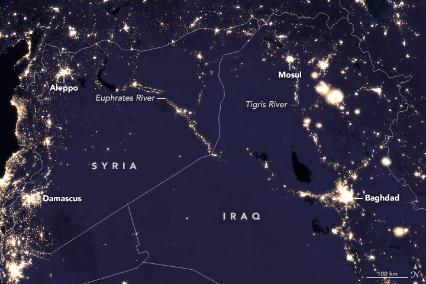
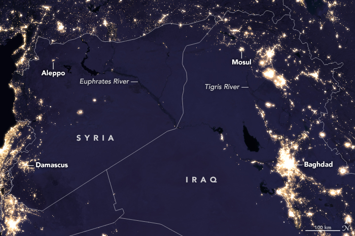
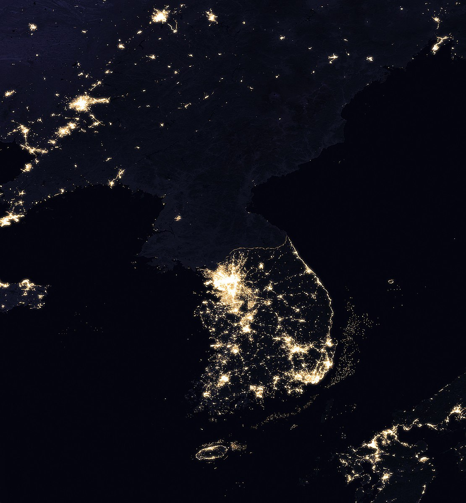

# Introduction to spatial maps 

Spatial economics studies where economic activity happens and why. It spans regional and urban economics and helps explain inequality, resource allocation, and regional policy.

Maps are a core tool for revealing geographic patterns, and R’s ecosystem makes it easy to handle, analyze, and visualize spatial data.

In this session we'll explore three datasets: 

* (1) the Student Survey to map German students' states of origin; 
* (2) G-Econ (Global Gridded Geographically Based Economics Data), which is a $1$° grid of global economic indicators (including Gross Cell Product) for 1990, 1995, 2000, and 2005, to cover basics; and 
* (3) NASA Black Marble night-lights to explore how luminosity proxies economic activity.

# Getting started
To begin, we'll need to install and load several R packages that will help us handle and visualize the spatial data. These include `sf` for handling spatial data, `raster` for raster data manipulation, and `ggplot2` for visualization.

```{r, warning=F, message=F}
#install.packages(c("sf", "raster"))

# Load the packages
library(sf)
library(raster)
library(ggplot2)
library(dplyr)
library(tidyverse)
library(RColorBrewer)
library(rnaturalearth)
library(rnaturalearthdata) 
library(rnaturalearthhires)
```

## Student Map

**Goal:** Create a map showing from which federal German states the German students from the Statistics course originated from.

The `rnaturalearth` package is a useful tool for accessing and visualizing global geographic data. It provides free global vector boundaries (country, state/province, etc.) at multiple scales and returns data compatible with spatial analysis libraries such as 
`sf`.

To get the borders of the German federal states, we use the `ne_states()` function from `rnaturalearth`. This function allows you to extract the boundaries of subnational units (like states or provinces) for a specified country. The data is returned as a `sf` object, which can easily be used for plotting or spatial analysis.

The `geom_sf()` function is provided by the ggplot2 package for visualizing spatial data using the Simple Features (`sf`) package. It allows to create a wide range of maps and spatial plots by directly plotting `sf` objects, which can represent various geometries such as points, lines, and polygons. 

```{r, message= F}
germany <- rnaturalearth::ne_states(country = "germany", returnclass = "sf") %>%
  dplyr::select(name)  # Only keep the 'name' column for state names

# View the German states map
ggplot(germany) +
  # Plot the spatial features (German state borders) from the 'germany' sf object.
  geom_sf() + 
  # Set the plot title to "Germany".
  labs(title = "Germany") +
  theme_minimal() +
  # Center the title and increase its font size to 20.
  theme(plot.title = element_text(hjust = 0.5, size = 20),
        # Remove axis titles to keep the plot clean.
        axis.title = element_blank(),
        # Remove the plot background.
        plot.background = element_blank(),
        # Adjust plot margins for spacing.
        plot.margin = margin(5, 0, 5, 0))
```

In a next step, we import the student survey data and drop all rows with missing information in `geburtsbundesland`.

```{r}
survey <- read.csv("../00_data/survey/survey_processed.csv") # Read in student survey

# Drop all rows with missing observations in geburtsbundesland
survey <- survey %>% 
  drop_na(geburtsbundesland_name) 
```

Next, we create a summary table that counts how many students originated from each Bundesland.

```{r}
student_counts <- survey %>%
  # Group the data by geburtsbundesland.
  group_by(geburtsbundesland_name) %>%
  # For each state, count the number of rows (students) and store 
  # this in a 'count' column.
  summarize(count = n())

student_counts # Display the data frame.
```


We join the two objects to create the final data frame.

```{r}
# Join the German states map with the student data based on state names
germany_student_map <- germany %>%
  left_join(student_counts, by = c("name" = "geburtsbundesland_name"))

# Replace missing counts with 0 for states with no students
germany_student_map <- germany_student_map %>%
  mutate(count = replace_na(count, 0))
```

Finally, we plot how many students originated from each state. For simplicity, we create bins to higlight and contrast states where many (e.g. 51-100) students originated of few to none (e.g. 0-5) students originated from. 

```{r, message= F, warning = F}
# Bin the 'count' variable into discrete categories
germany_student_map <- germany_student_map %>%
  # Bin the 'count' variable into intervals.
  mutate(count_bin = cut(count, breaks = c(0, 5, 10, 20, 50, 100, Inf),
                         # Assign labels to each bin.
                         labels = c("0-5", "6-10", "11-20", "21-50", "51-100", "100+"),
                         # Include the lowest value (0) in the first bin.
                         include.lowest = TRUE))

# Plot the map with discrete color bins
ggplot(germany_student_map) +
  geom_sf(aes(fill = count_bin), color = "white") +  # Use binned color fill
  scale_fill_brewer(palette = "Blues", name = "Student Count") +  
  geom_sf_text(aes(label = name), size = 3, color = "black") +  # Add state labels
  labs(title = "Number of Students from Each German State") +
  theme_minimal() +
  theme(plot.title = element_text(hjust = 0.5, size = 20),
        axis.title = element_blank(),
        plot.background = element_blank(),
        plot.margin = margin(5, 0, 5, 0),
        legend.position = "right")

```

## GDP Map

**Goal:** Create global maps using a gridded data structure.

Spatial data can come in several different forms. We can distinguish between point data, line data, polygon data, or a grid. All georeferenced data have positional attributes that define their location on the Earth's surface.

- **Point data** represent specific locations with a single coordinate, such as the location of a restaurant or a weather station.
- **Line data** consist of sequences of connected points and are used to represent linear features like roads, rivers, or paths.
- **Polygon data** are used to represent areas with defined boundaries, such as countries, lakes, or land parcels.
- **Grid data** (or raster data) consist of a matrix of cells or pixels, each with a value representing phenomena like elevation, temperature, or land cover.

These different forms of spatial data are used to capture various types of geographic information and can be analyzed and visualized to support decision-making, spatial analysis, and geographic research.


### Loading the G-Econ Data {.unlisted .unnumbered}

The Global Gridded Geographically Based Economic Data (G-Econ) is a comprehensive dataset designed to provide detailed and globally consistent economic information at a fine spatial resolution. Developed by researchers to support economic and environmental analysis, G-Econ offers gridded data on economic variables such as GDP, population, and infrastructure, aggregated into a regular grid format.


```{r, message=F}
data <- read_csv("data/gecon_v5.csv")
head(data)
```


### Visualizing data on the map {.unlisted .unnumbered}

Since the location of your observations are represented as a longitude-latitude pair, we use the `geom_tile`function. It creates a grid-based plot where each cell (or tile) represents a combination of longitude and latitude coordinates. In our case, the color of each tile corresponds to the population density in 2005 (`pop_2005`).

```{r}
data %>% 
  ggplot(aes(x = lon, y = lat, fill = pop_2005)) +
    geom_tile() +  # Use geom_tile to create a grid-based map
    # Define a color palette and control the direction of the scale (1/-1)
    scale_fill_distiller(name = "Population density 2005", palette = "Reds", direction = -1)+
    labs(title = " ", 
       x = "Longitude", 
       y = "Latitude") +
    theme_minimal() +  # Minimal theme for a clean look
    theme(
      plot.title = element_text(hjust = 0.5, size = 16),
      axis.title = element_text(size = 12),
      axis.text = element_text(size = 10)
  )
```

Next, we try to create a plot for the GDP in 1990. This is a little bit more challenging, because this variable is not really suitable for a plot with a continous color scale plot.

```{r}
summary(data$gcp_1990) # Summary statistics for the gcp in 1990
```

What happens if we create the same plot as before and only change the variable name?


```{r}
data %>%
  ggplot(aes(x = lon, y = lat, fill = gcp_2005)) +
    geom_tile() +  # Use geom_tile to create a grid-based map
    # Define a color palette and control the direction of the scale (1/-1)
    scale_fill_distiller(name = "GCP 2005", palette = "Reds", direction = 1, na.value = "black")+   
    labs(title = " ", 
       x = "Longitude", 
       y = "Latitude") +
    theme_minimal() +  
    theme(
      plot.title = element_text(hjust = 0.5, size = 16),
      axis.title = element_text(size = 12),
      axis.text = element_text(size = 10)
  )
```


Instead, we could again cut the variable of interest into informative bins to visualize the global distribution. 


### Point and polygon data {.unlisted .unnumbered}

We can convert the gridded data again into a spatial features (`sf`) object and visualize the data as points. 
```{r}
head(data)
```


```{r}
# Convert to an sf object
g_econ_sf <- st_as_sf(data, coords = c("lon", "lat"), crs = 4326)

# Inspect the spatial object
head(g_econ_sf)
```


```{r}
# Basic map of Gross Cell Product for a specific year (e.g., 2000)
g_econ_sf %>% 
  ggplot() +
    geom_sf(aes(colour = gcp_2005),size = 0.5) +
    scale_colour_distiller(palette = "Spectral", name = "Gross Cell Product" ) +
    labs(title = "Spatial Distribution of Gross Cell Product (2005)",
       caption = "Source: G-Econ v4") +
    theme_minimal()
```


```{r}
# Basic map of Gross Cell Product for a specific year (e.g., 2005) in China
g_econ_sf %>%
  filter(country == "China") %>%
  ggplot() +
    geom_sf(aes(colour = gcp_2005),size = 2) +
    scale_colour_distiller(palette = "Spectral", name = "Gross Cell Product" ) +
    labs(title = "Spatial Distribution of Gross Cell Product in China (2005)",
       caption = "Source: G-Econ v4") +
    theme_minimal()
```


```{r}
# Changeing the country - feel free to play around with this!
g_econ_sf %>%
  filter(country == "Germany") %>%
  ggplot() +
    geom_sf(aes(colour = gcp_2005),size = 2) +
    scale_colour_distiller(palette = "Spectral", name = "Gross Cell Product" ) +
    labs(title = "Spatial Distribution of Gross Cell Product in India (2005)",
       caption = "Source: G-Econ v4") +
    theme_minimal()
```

Now we would like to use this data and aggregate to country or county level. For that we need the shapes or boundaries (polgyons) of the areas that we are interested in, e.g. a global map with country borders.
To convert the G-Econ v4 dataset from a point raster object to a polygon object and filter it by country, you need to aggregate the point data into polygons and associate each point with the corresponding country.

```{r}
# Download country boundaries
world <- ne_countries(scale = "medium", returnclass = "sf")
head(world)
```


```{r}
# Spatial join
g_econ_joined <- st_join(g_econ_sf, world[, c("name_long", "iso_a3")], join = st_within)

# Check the joined data
head(g_econ_joined)
```

Convert the point data to polygon data by aggregating points within each country boundary. This step will depend on how you want to aggregate the data (e.g., summing or averaging the economic data).

```{r}
# Create a data frame summarizing the GDP per country, the 
# iso_a3 variable is a unique id for each country.
g_econ_aggregated <- g_econ_joined %>%
  group_by(iso_a3) %>%
  summarise(mean_gcp_2005 = mean(gcp_2005, na.rm = TRUE))

# Transforms the data to a dataframe format and defines a color
# scale for tmap.
g_econ_aggregated <- as.data.frame(g_econ_aggregated)
range <- seq(0,5,0.5)
breaks <- c(range, max(g_econ_aggregated$mean_gcp_2005, na.rm = TRUE))
mycolors <- colorRampPalette(rev(brewer.pal(11, "Spectral")))(length(breaks))

# Join aggregated data with world polygons
world_aggregated <- world %>%
  left_join(g_econ_aggregated, by = c("iso_a3" = "iso_a3"))

# Check the aggregated data
head(world_aggregated)

```


Plot the aggregated polygon data!

```{r}
# Plotting the aggregated data
world %>%
  ggplot() +
    geom_sf() +
    labs(title = "Country Boundaries") +
    theme_minimal()
```


```{r}
world_aggregated %>% 
  ggplot() +
    geom_sf(aes(fill = cut(mean_gcp_2005, breaks = breaks)), color = NA) +  # Remove borders
      scale_fill_manual(values = mycolors, name = "") +
      labs(title = "Mean Gross Cell Product by Country (2005)",
       caption = "Source: G-Econ v4") +
      theme_minimal()
```

We can also plot this pattern on a 3D sphere. To that end, we can use the `coord_sf()` function in the ggplot command with an orthographic projection. Here’s how you can modify your code to achieve this: set the function to `coord_sf(crs = "+proj=ortho +lat_0=0 +lon_0=0")` to apply the orthographic projection, centered around the equator (latitude 0, longitude 0). Adjust the `lat_0` and `lon_0` parameters as needed to center the projection around a different region. 


```{r}
world_aggregated %>% 
  ggplot() +
    geom_sf(aes(fill = cut(mean_gcp_2005, breaks = breaks)), color = NA) +  # Remove borders
    scale_fill_manual(values = mycolors, name = "") +
    labs(title = "Mean Gross Cell Product by Country (2005)",
       caption = "Source: G-Econ v4") +
    coord_sf(crs = "+proj=ortho +lat_0=30 +lon_0=100") +  # Orthographic projection centered around the equator
    theme_minimal()
```


Instead of using the grid structure of the data, we can also create a spatial object

# Nighttime lights 

**Goal:** Create a nighttime lights plot. 

Nighttime lights are a practical proxy for economic activity and inequality. Satellite-measured brightness tracks urbanization, infrastructure, and growth, and helps fill data gaps - especially during wars, conflicts, or disasters when official statistics are missing. Example: night-light changes in the Middle East, 2012–2016 (NASA Earth Observatory: https://earthobservatory.nasa.gov/images/90100/night-lights-change-in-the-middle-east).

2012             |   2016
:-------------------------:|:-------------------------:
  |  

Moreover, nighttime lights can reveal spatial inequalities within and between countries. By mapping light intensity, researchers can identify regions with concentrated economic activity versus those with minimal activity, shedding light on disparities in infrastructure, services, and living standards. Here is an example of the korean peninsula, showing the contrast between North Korea and South Korea in terms of nighttime activity. 



We will use Night Time Lights BlackMarble data from Syria, made available by the Worldbank [(Link)](https://datacatalog.worldbank.org/search/dataset/0063879/Syria---Night-Time-Lights).

## Study case - Syria {.unlisted .unnumbered}
```{r}
library(raster)
library(ggplot2)
library(sf)
library(rnaturalearth)
```

In R, the `raster` format is used to represent and analyze spatial data that is organized in a grid or matrix of cells, each containing a value. This format is particularly useful for handling data from satellite imagery, digital elevation models, and other types of gridded geographic data.

The `raster` package provides tools for creating, manipulating, and analyzing raster data. It supports a variety of raster file formats, including TIFF, JPEG, and ESRI Grid. Functions in this package allow users to perform operations such as reading raster files, extracting cell values, and performing spatial analysis.

```{r}
# Defines the data path
data_path = "data/"
june_2012_file <- "bm_vnp46A3_2012_06.tif"

# This line reads the raster file as a raster object using the raster function. 
# The resulting object, nightlight_raster, contains the spatial data from 
# the TIFF file, which can be used for further analysis or visualization.
nightlight_raster <- raster(paste0(data_path,june_2012_file))
```


```{r}
nightlight_raster$bm_vnp46A3_2012_06
```

Now we create a data frame that we can use for plotting. 

```{r}
# Obtaining the country boundary of Syria for your map
syria <- ne_countries(country = "Syria", scale = "medium", returnclass = "sf")


# Converts the nightlight_raster object into a data frame. 
# The xy = TRUE argument ensures that the output includes the spatial 
# coordinates (x and y) of each cell in the raster.
nightlight_df <- as.data.frame(nightlight_raster, xy = TRUE)

# Assigns column names for the data frame
colnames(nightlight_df) <- c("Longitude", "Latitude", "Nightlight")

# Print the first few lines of the resulting data frame
head(nightlight_df)
```


We produce a first naive plot using the `geom_raster()` function. 


```{r}
ggplot() +
  geom_raster(data = nightlight_df, aes(x = Longitude, y = Latitude, fill = Nightlight)) +
  scale_fill_viridis_c() +  # Use a suitable color scale
  geom_sf(data = syria, fill = NA, color = "black") +  # Add the boundary of Syria
  coord_sf() +
  theme_minimal() +
  labs(title = "Nighttime Lights in Syria",
       fill = "Light Intensity")
```

Why can we not see any pattern? Let us have a look at the data again.


```{r}
summary(nightlight_df$Nightlight)

#How many non-zero observations?
nightlight_df <- nightlight_df %>%
  mutate(Nightlight_zero = if_else(Nightlight != 0, 1, 0))

# Count the occurrences of 0 and 1
nightlight_df %>%
  count(Nightlight_zero)
```

Obviously, there are some extreme outliers. We remove them and see if this helps us.

```{r}
## Remove outliers by capping extreme values

# Calculate quantiles
quantiles <- quantile(nightlight_df$Nightlight, probs = c(0.01, 0.99))

# Apply quantiles and create the new column
nightlight_df <- nightlight_df %>%
  mutate(Nightlight_quantiles = pmax(quantiles[1], pmin(Nightlight, quantiles[2])))
```


Et voila!

```{r}
ggplot() +
  geom_raster(data = nightlight_df, aes(x = Longitude, y = Latitude, fill = Nightlight_quantiles)) +
  scale_fill_viridis_c() +  # Use a suitable color scale
  geom_sf(data = syria, fill = NA, color = "black") +  # Add the boundary of Syria
  coord_sf() +
  theme_minimal() +
  labs(title = "Nighttime Lights in Syria 2012",
       fill = "Light Intensity")
```


Questions!

```{r, warning = FALSE}
library(Hmisc)

# Create a simple data frame
data <- data.frame(
  age = c(25, 30, 35),
  income = c(50000, 60000, 70000)
)

# Assign labels to the variables
label(data$age) <- "Age of the person"
label(data$income) <- "Annual income in USD"

# Check the labels
label(data$age)
label(data$income)

#label(data)
```


# Sources {.unlisted .unnumbered}
- Nordhaus, W.D., and X. Chen. (2016). Global Gridded Geographically Based Economic Data (G-Econ), Version 4. Palisades, New York: NASA Socioeconomic Data and Applications Center (SEDAC). http://doi.org/10.7927/H42V2D1C. 
- Marty, R., & Vicente, G. S. (2024). Illuminating insights: harnessing NASA’s Black Marble with R and Python packages. World Bank Blogs. https://blogs.worldbank.org/en/opendata/illuminating-insights-harnessing-nasas-black-marble-r-and-python-packages. 

&nbsp;
\


